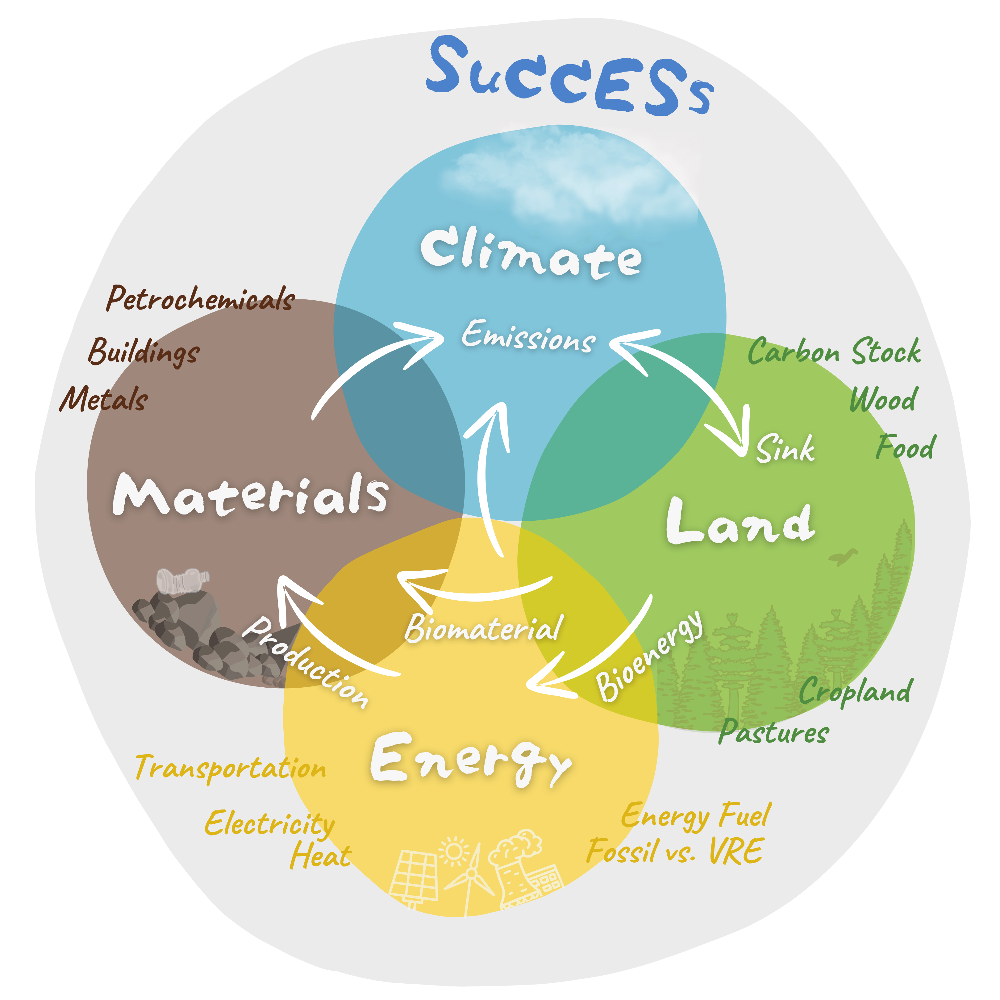

 
These pages show results of a study on the global climate mitigation performance of land, conducted by Freistetter et al. (2024, manuscript in preparation).
  
<h3 style="color: #808080;">800+ Scenarios</h3>
 We assessed a total of 864 scenarios combining different scenarios from the scenario domains 
- Carbon tax
- Global diet
- Regional agricultural self-sufficiency
- Biodiversity policies
- Wood demand
- Forest fire risk

  
<h3 style="color: #808080;">The SuCCESs IA-Model</h3>
In this study, we employed the SuCCESs integrated assessment model (Ekholm T. et al., 2024, manuscript in preparation) - a new, lightweight optimazation model able to assess global climate change mitigation options. It calculates long-term sceanrios (2020-2100) satisfying global demands for climate-relevant products and services, such as transportation, plant and livestock-based foods, fossil and renewable types of energy, bio-based and fossil materials for industry and construction, and more. Its output includes, among many things, the decadal global mean temperature rise (above pre-industrial measures), emissions of CO2, CH4 and N2O and the energy mix.
  
{: width="300px"}
  
The model has four main parts: Energy, Materials, Land-Use and Climate. These parts enable a broad analysation of feedback mechanisms of employing one or multiple mitigation strategies at once.
 

