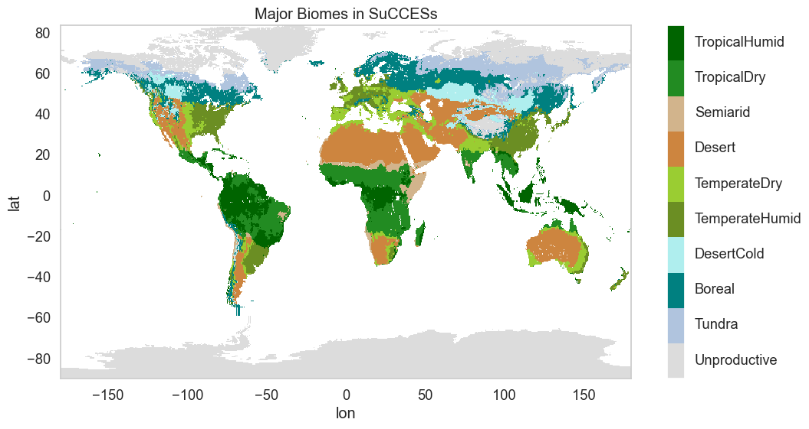

 

  <i> 
    How much can global land  
    contribute to climate change mitigation  
    under varying land-consuming lifestyles?  
  </i>

  

  
  {: width="700px"}
  

  
Land-based climate solutions like reforestation and afforestation compete with food, biomaterial, and bioenergy production for land. Thus, the availability of land for climate mitigation largely depends on societal choices and lifestyles.
  
Find out more about our research here!
