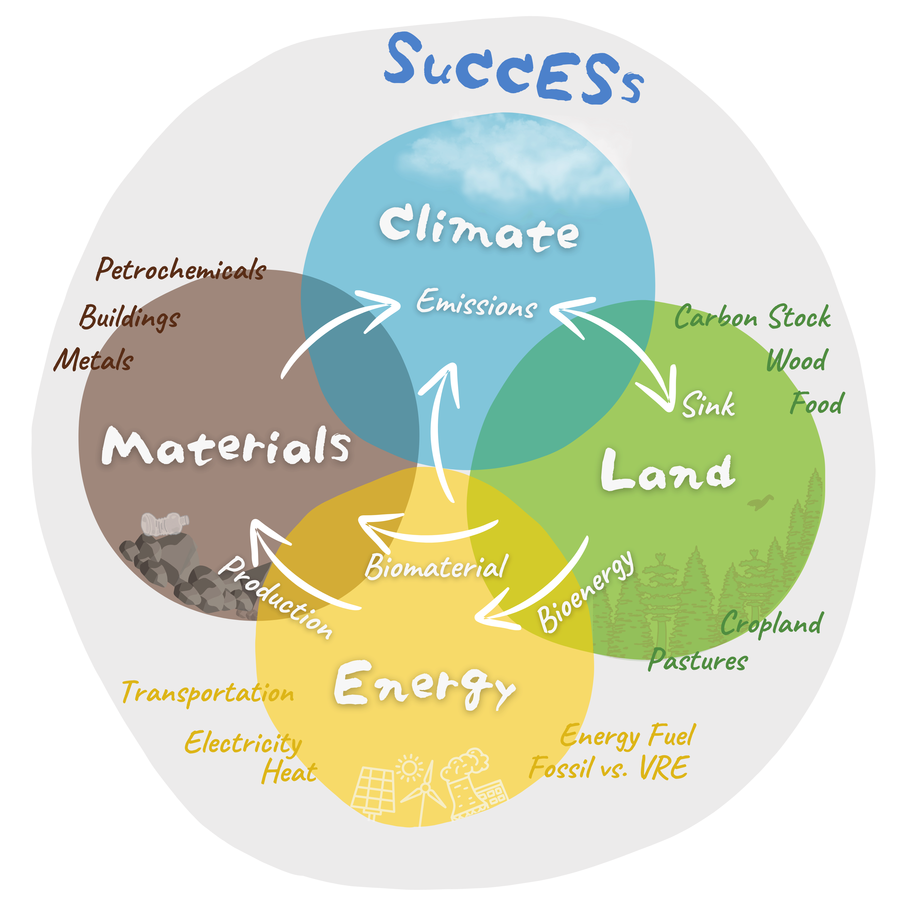

 
These pages present results from a study by Freistetter et al. (2024, manuscript in preparation) on how much land can help mitigate global climate change.

  
<h3 style="color: #808080;">800+ Scenarios</h3>
 We assessed a total of 864 scenarios combining different scenarios from the scenario domains 
- Carbon tax
- Global diet
- Regional agricultural self-sufficiency
- Biodiversity policies
- Wood demand
- Forest fire risk

  
<h3 style="color: #808080;">The SuCCESs Model</h3>

In this study, we used the SuCCESs integrated assessment model, which is a new, lightweight optimization model designed to evaluate global climate change solutions (Ekholm et al., 2024, manuscript in preparation). 

It calculates scenarios from 2020 to 2100, fulfilling global needs for products and services that impact the climate, such as transportation, plant and livestock-based foods, fossil and renewable energy, and bio-based and fossil materials for industry and construction. 

The model's outputs include the projected global temperature rise above pre-industrial levels, emissions of CO2, CH4, and N2O, and the composition of the energy mix.
  

{: width="600px"}

  
The model has four main parts: Energy, Materials, Land-Use and Climate. These parts enable a broad analysis of (beneficial or detrimental) feedback mechanisms when employing multiple mitigation strategies at once.
 

